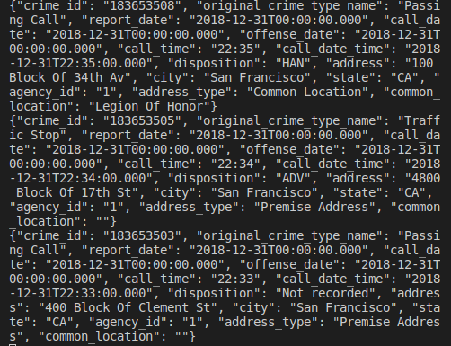

# Streaming Practice

This repository is a practice of streaming data handling using Kafka and Spark Streaming as a project for Udacity Data Streaming Nanodegree.  

This produces a stream stream that sends San Franciso Crime data periodically using Kafka, and consumes the stream data using Kafka and Apache Spark Stream. 


## Required environment

- Spark 2.4.3
- Scala 2.11.x
- Java 1.8.x
- Kafka build with Scala 2.11.x
- Python 3.6.x or 3.7.x
- Anaconda 

## Steps to run 

0.  Install all of the requirements above

1.  Install required packages by 
```
conda install -r requirements.txt
pip install kafka-python
pip install findspark

 ```

2. Download the data ('police-department-calls-for-service.json') and place on the same folder of `kafka_server.py'. This data comes from Kaggle (https://www.kaggle.com/c/sf-crime/data)


3. Run Zookeeper server. In the folder you have installed kafka, run following
```
./bin/zookeeper-server-start.sh config/zookeeper.properties
```

4. Run Kafka server. In the folder you have installed kafka, run following

```
./bin/kafka-server-start.sh config/server.properties

```
5. Run Kafka Producer server
```
python kafka_server.py

```

6. Find topics . In the folder you have installed kafka, run following

```
./bin/kafka-topics.sh --list --zookeeper localhost:2181
```

7. Consume the stream data. In the folder you have installed kafka, run following (in case of "new_topic" topic)

```
./bin/kafka-console-consumer.sh --bootstrap-server localhost:9092 --topic new_topic 

```
you will find the data like below start flowing (1 data every second)




